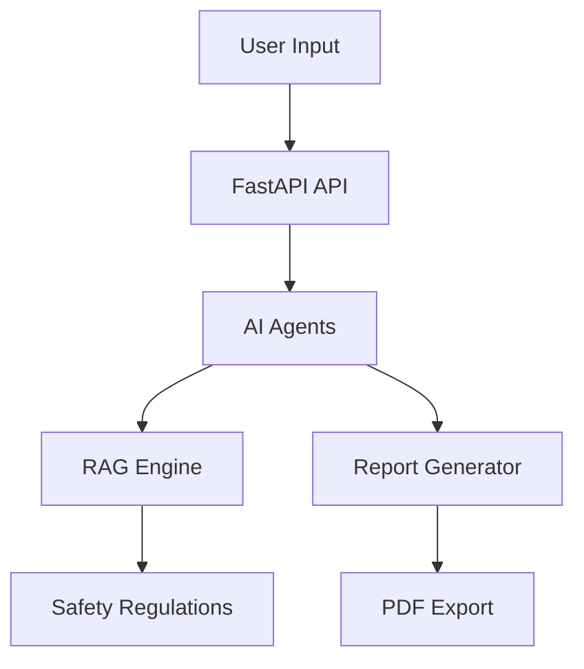

# AI Safety Report Generator


AI-powered platform that automatically generates industrial safety compliance reports using multi-agent AI and Retrieval-Augmented Generation (RAG).

## Features

- AI hazard analysis
- Automated safety report generation
- Compliance with safety regulations (Australian WHS)
- PDF and DOCX report export
- Multi-agent AI architecture
- FastAPI backend
- Inspection workflow
- KPI dashboard & analytics
- AI Safety Advisor (chat)
- Docker deployment

## Architecture



## Example Output

### AI INDUSTRIAL SAFETY REPORT

Site: Construction Site A
Date: 12 March 2026

Hazards Identified
• Working at height
• Electrical exposure

Risk Assessment
• Working at height → High Risk

Control Measures
• Install guard rails
• Provide safety harness

Compliance
WHS Regulation Part 4.4 – Falls

---


## Installation

1. Clone the repository:
	```bash
	git clone https://github.com/saikiranyt2001/safety-report-trial.git
	```
2. Install Python dependencies:
	```bash
	pip install -r safety_report_trial/backend/requirements.txt
	```
3. Start backend (FastAPI):
	```bash
	uvicorn safety_report_trial.backend.main:app --reload
	```
4. Start frontend:
	- Open frontend/dashboard.html in browser
5. (Optional) Start Celery workers and Flower for job monitoring
6. (Optional) Deploy with Docker:
	```bash
	docker-compose up --build
	```

## Usage

- Login with your credentials
- Generate safety reports for projects
- Ask safety questions to the AI Safety Advisor
- View analytics and report history
- Export reports as PDF/DOCX

## API Documentation

- `/generate-report` — Generate a safety report
- `/report-history/{project_id}` — Get report history
- `/analytics/{company_id}` — Safety KPIs
- `/safety-advisor` — AI safety Q&A
- `/validate-report` — Validate report quality

## Project Structure

```
├ backend
│   ├ agents
│   ├ api
│   ├ database
│   ├ rag
│   ├ services
│   ├ inspection
│   ├ utils
│   ├ document_export
│   ├ logs
│   ├ schemas
│   └ main.py
├ frontend
│   ├ dashboard.html
│   └ ...
├ workers
├ tests
├ storage
├ docker-compose.yml
├ requirements.txt
├ README.md
```

---

## License

MIT License